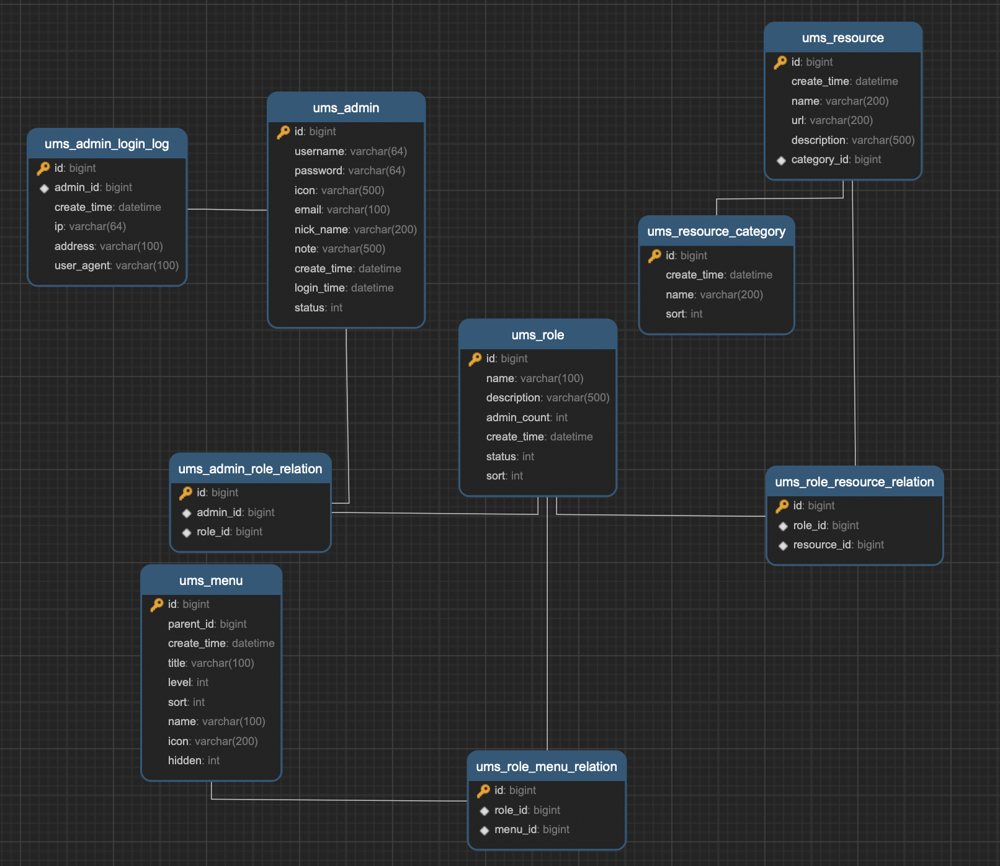

参考仓库：https://github.com/macrozheng/mall-tiny

mall-tiny是一款基于SpringBoot+MyBatis-Plus的快速开发脚手架，拥有完整的权限管理功能，可对接Vue前端，开箱即用。

## 技术选型

| 技术                   | 版本    | 说明             |
| ---------------------- | ------- | ---------------- |
| SpringBoot             | 2.3.0   | 容器+MVC框架     |
| SpringSecurity         | 5.3.2   | 认证和授权框架   |
| MyBatis                | 3.5.4   | ORM框架          |
| MyBatis-Plus           | 3.3.2   | MyBatis增强工具  |
| MyBatis-Plus Generator | 3.3.2   | 数据层代码生成器 |
| Swagger-UI             | 2.9.2   | 文档生产工具     |
| Redis                  | 5.0     | 分布式缓存       |
| Docker                 | 18.09.0 | 应用容器引擎     |
| Druid                  | 1.1.10  | 数据库连接池     |
| JWT                    | 0.9.0   | JWT登录支持      |
| Lombok                 | 1.18.12 | 简化对象封装工具 |

## 数据库表结构

